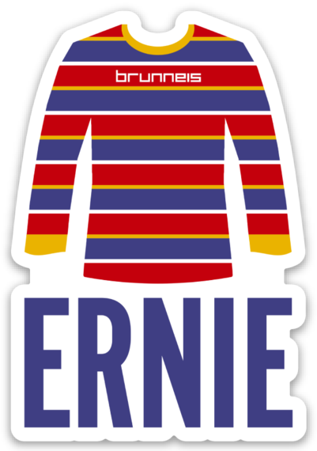

<p align="center">
    <br>
    <a href="https://github.com/labteral/ernie#stickers-by-sticker-mule" alt="Stickers section"></a>
    <br>
<p>

<p align="center">
    <a href="https://pepy.tech/project/ernie/"></a>
    <a href="https://pypi.python.org/pypi/ernie/"></a>
    <a href="https://github.com/labteral/ernie/releases"></a>
    <a href="https://github.com/labteral/ernie/blob/master/LICENSE"></a>
</p>

<h3 align="center">
    <b>BERT's best friend.</b>
</h3>

<p align="center">
    <a href="https://www.buymeacoffee.com/brunneis" target="_blank"></a>
</p>

# Installation
> Ernie requires Python 3.6 or higher.
```bash
pip install ernie
```
<a href="https://colab.research.google.com/drive/10lmqZyAHFP_-x4LxIQxZCavYpPqcR28c"></a>

# Fine-Tuning
## Sentence Classification
```python
from ernie import SentenceClassifier, Models
import pandas as pd

tuples = [
    ("This is a positive example. I'm very happy today.", 1),
    ("This is a negative sentence. Everything was wrong today at work.", 0)
]
df = pd.DataFrame(tuples)

classifier = SentenceClassifier(
    model_name=Models.BertBaseUncased,
    max_length=64,
    labels_no=2
)
classifier.load_dataset(df, validation_split=0.2)
classifier.fine_tune(
    epochs=4,
    learning_rate=2e-5,
    training_batch_size=32,
    validation_batch_size=64
)
```

# Prediction
## Predict a single text
```python
text = "Oh, that's great!"

# It returns a tuple with the prediction
probabilities = classifier.predict_one(text)
```

## Predict multiple texts
```python
texts = ["Oh, that's great!", "That's really bad"]

# It returns a generator of tuples with the predictions
probabilities = classifier.predict(texts)
```

## Prediction Strategies
If the length in tokens of the texts is greater than the `max_length` with which the model has been fine-tuned, they will be truncated. To avoid losing information you can use a split strategy and aggregate the predictions in different ways.

### Split Strategies
- `SentencesWithoutUrls`. The text will be splitted in sentences.
- `GroupedSentencesWithoutUrls`. The text will be splitted in groups of sentences with a length in tokens similar to `max_length`.

### Aggregation Strategies
- `Mean`: the prediction of the text will be the mean of the predictions of the splits.
- `MeanTopFiveBinaryClassification`: the mean is computed over the 5 higher predictions only.
- `MeanTopTenBinaryClassification`: the mean is computed over the 10 higher predictions only.
- `MeanTopFifteenBinaryClassification`: the mean is computed over the 15 higher predictions only.
- `MeanTopTwentyBinaryClassification`: the mean is computed over the 20 higher predictions only.

```python
from ernie import SplitStrategies, AggregationStrategies

texts = ["Oh, that's great!", "That's really bad"]
probabilities = classifier.predict(
    texts,
    split_strategy=SplitStrategies.GroupedSentencesWithoutUrls,
    aggregation_strategy=AggregationStrategies.Mean
) 
```


You can define your custom strategies through `AggregationStrategy` and `SplitStrategy` classes.
```python
from ernie import SplitStrategy, AggregationStrategy

my_split_strategy = SplitStrategy(
    split_patterns: list,
    remove_patterns: list,
    remove_too_short_groups: bool,
    group_splits: bool
)
my_aggregation_strategy = AggregationStrategy(
    method: function,
    max_items: int,
    top_items: bool,
    sorting_class_index: int
)
```

# Save and restore a fine-tuned model
## Save model
```python
classifier.dump('./model')
```

## Load model
```python
classifier = SentenceClassifier(model_path='./model')
```

# Interrupted Training
Since the execution may break during training (especially if you are using Google Colab), you can opt to secure every new trained epoch, so the training can be resumed without losing all the progress.

```python
classifier = SentenceClassifier(
    model_name=Models.BertBaseUncased,
    max_length=64
)
classifier.load_dataset(df, validation_split=0.2)

for epoch in range(1, 5):
    if epoch == 3:
        raise Exception("Forced crash")

    classifier.fine_tune(epochs=1)
    classifier.dump(f'./my-model/{epoch}')
```

```python
last_training_epoch = 2

classifier = SentenceClassifier(model_path=f'./my-model/{last_training_epoch}')
classifier.load_dataset(df, validation_split=0.2)

for epoch in range(last_training_epoch + 1, 5):
    classifier.fine_tune(epochs=1)
    classifier.dump(f'./my-model/{epoch}')
```

# Autosave
Even if you do not explicitly dump the model, it will be autosaved into `./ernie-autosave` every time `fine_tune` is successfully executed. 

```
ernie-autosave/
└── model_family/
    └── timestamp/
        ├── config.json
        ├── special_tokens_map.json
        ├── tf_model.h5
        ├── tokenizer_config.json
        └── vocab.txt
```

You can easily clean the autosaved models by invoking `clean_autosave` after finishing a session or when starting a new one.
```python
from ernie import clean_autosave
clean_autosave()
```

# Supported Models

You can access some of the official base model names through the `Models` class. However, you can directly type the HuggingFace's model name such as `bert-base-uncased` or `bert-base-chinese` when instantiating a `SentenceClassifier`.

> See all the available models at [huggingface.co/models](https://huggingface.co/models).

## BERT
- `BertBaseUncased`
- `BertBaseCased`
- `BertLargeUncased`
- `BertLargeCased`

## RoBERTa
- `RobertaBaseCased`
- `RobertaLargeCased`

## XLNet
- `XLNetBaseCased`
- `XLNetLargeCased`

## DistilBERT
- `DistilBertBaseUncased`
- `DistilBertBaseMultilingualCased`

## ALBERT
- `AlbertBaseCased`
- `AlbertLargeCased`
- `AlbertXLargeCased`
- `AlbertXXLargeCased`
- `AlbertBaseCased2`
- `AlbertLargeCased2`
- `AlbertXLargeCased2`
- `AlbertXXLargeCased2`

# Additional Info

## Accesing the model and tokenizer
You can directly access both the model and tokenizer objects once the classifier has been instantiated:
```python
classifier.model
classifier.tokenizer
```

## Keras `model.fit` arguments
You can pass Keras arguments of the `model.fit` method to the `classifier.fine_tune` method. For example:
```python
classifier.fine_tune(class_weight={0: 0.2, 1: 0.8})
```

<br>

# Sponsors
<a href="http://stickermule.com/supports/ernie20-sponsorship"></a>
